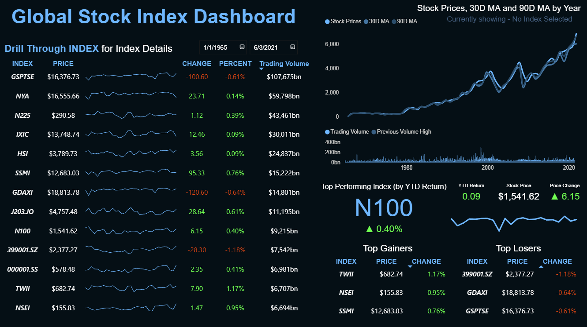

# Global Stock Index Performance Analysis Dashboard

This repository contains the end-to-end data analysis project for a global stock market index dataset. The project utilizes MySQL for data storage and querying, and Microsoft Power BI for comprehensive data visualization and interactive dashboard creation. The primary goal is to analyze long-term performance, trends, and key metrics across major global stock indices.

This project is currently ongoing, with plans to include more advanced features and analysis in the future.

### Power BI Dashboard:

---

## Executive Summary
This project provides a comprehensive visual analysis of historical and recent data for major global stock market indices. By processing and storing a large dataset in a MySQL database, we've enabled efficient querying and analysis. The core of this project is an interactive Power BI dashboard designed to offer users—from financial analysts to retail investors—a powerful tool to explore market trends, compare index performance, and gain actionable insights from a high-level overview down to daily specifics.

---

## Summary of Key Findings
Significant Long-Term Growth: The S&P 500 (GSPTSE) and other major indices demonstrate substantial long-term growth, underscoring the market's resilience and upward trajectory over decades.

* **Volatility Insights:** Analysis of 30-day and 90-day moving averages alongside trading volume effectively highlights periods of high market volatility, such as the 2008 financial crisis and the dot-com bubble.

* **Performance Benchmarking:** The dashboard allows for easy identification of top-performing indices based on Year-to-Date (YTD) returns, as well as daily top gainers and losers, offering a quick snapshot of current market leadership and sentiment.

* **User-Driven Exploration:** The interactive nature of the dashboard, featuring drill-through capabilities, empowers users to dynamically filter by date and investigate the detailed performance of specific indices.

---

## Project Overview & Objective
The primary objective of this project is to design and build an intuitive Power BI dashboard that provides a multi-faceted view of global stock market performance.

The key goals were to:

* Source, clean, and structure historical stock index data.

* Establish a robust MySQL database to store and manage the time-series data efficiently.

* Develop meaningful Key Performance Indicators (KPIs), including price changes, moving averages, trading volume, and YTD returns.

* Create a visually compelling and user-friendly dashboard that enables both high-level trend analysis and detailed, granular investigation.

---

## Visualizations & Key Dashboards
The main dashboard is designed for clarity and depth, providing a central hub for market analysis.

* **Historical Performance Chart:** A primary line chart visualizes stock prices against 30-day and 90-day moving averages from 1965 to the present, clearly showing long-term trends and major market events.

* **Index Details Table:** A comprehensive and sortable table lists major indices (GSPTSE, NYA, N225, etc.) with key daily metrics: current price, change, percent change, and trading volume.

* **KPI Cards & Highlights:** Dedicated cards showcase the top-performing index by YTD return and highlight the top daily gainers and losers to capture immediate market movements.

* **Trading Volume Analysis:** An integrated area chart tracks historical trading volume, allowing for correlation analysis between market activity and price action.
